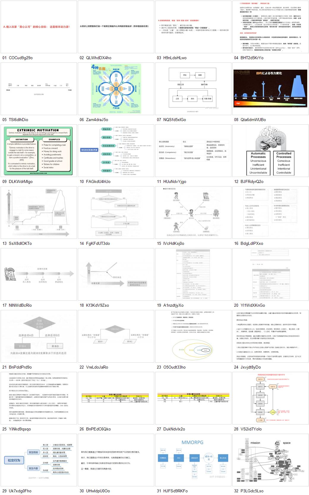

# 图片索引

> 来源：飞书文档《游戏情感》。图片已按原文出现顺序编号。`contact-sheet.jpg` 是总览图；视觉备注为初步识别，后续可继续做逐图 OCR 精修。

| 编号 | 文件 | 原块 ID | 初步视觉备注 |
| --- | --- | --- | --- |
| 01 | [assets/feishu-game-emotion/01_COCud9g29oCiVZx4XOAcaaStnUf.png](assets/feishu-game-emotion/01_COCud9g29oCiVZx4XOAcaaStnUf.png) | `COCud9g29oCiVZx4XOAcaaStnUf` | 成瘾/动机机制文字图：植入玩家真心认可的核心目标。 |
| 02 | [assets/feishu-game-emotion/02_QLWhdDX4hoEj5txq8xMc9xIJnid.png](assets/feishu-game-emotion/02_QLWhdDX4hoEj5txq8xMc9xIJnid.png) | `QLWhdDX4hoEj5txq8xMc9xIJnid` | 成瘾/目标链路文字图：需求、目标与持续投入的关系。 |
| 03 | [assets/feishu-game-emotion/03_H9nLdsHLwoVo8rxkQD0cGWyBn4f.png](assets/feishu-game-emotion/03_H9nLdsHLwoVo8rxkQD0cGWyBn4f.png) | `H9nLdsHLwoVo8rxkQD0cGWyBn4f` | 成瘾机制文字图：强化明确目标、奖励反馈与行为循环。 |
| 04 | [assets/feishu-game-emotion/04_BHT2d5KrYoPvOQxH5cjc3RxVnVe.png](assets/feishu-game-emotion/04_BHT2d5KrYoPvOQxH5cjc3RxVnVe.png) | `BHT2d5KrYoPvOQxH5cjc3RxVnVe` | 成瘾机制长文截图：围绕反馈、阶段目标、奖励和持续动机展开。 |
| 05 | [assets/feishu-game-emotion/05_TSl6dIhDioiLeGxHrS0cCh5mnPg.png](assets/feishu-game-emotion/05_TSl6dIhDioiLeGxHrS0cCh5mnPg.png) | `TSl6dIhDioiLeGxHrS0cCh5mnPg` | 战斗类型谱系图：从被动型到主动型的玩法比例。 |
| 06 | [assets/feishu-game-emotion/06_Zam4draJ5oYJDJx2cX7cndN6nSe.png](assets/feishu-game-emotion/06_Zam4draJ5oYJDJx2cX7cndN6nSe.png) | `Zam4draJ5oYJDJx2cX7cndN6nSe` | 游戏四种乐趣示意图：围绕核心乐趣拆分不同体验来源。 |
| 07 | [assets/feishu-game-emotion/07_NQSfd5xIGo1FuexQiNoc3bPanec.png](assets/feishu-game-emotion/07_NQSfd5xIGo1FuexQiNoc3bPanec.png) | `NQSfd5xIGo1FuexQiNoc3bPanec` | 核心战斗循环流程图：玩家行为、反馈与问题解决的循环。 |
| 08 | [assets/feishu-game-emotion/08_Qta6dmWUBoa8J5xiUftch0UpnKd.png](assets/feishu-game-emotion/08_Qta6dmWUBoa8J5xiUftch0UpnKd.png) | `Qta6dmWUBoa8J5xiUftch0UpnKd` | 主线/目的牵引示意图：日文图，展示目标驱动力变化。 |
| 09 | [assets/feishu-game-emotion/09_DLKWdrMIgoCkzEx4sDccHnOgnA0.png](assets/feishu-game-emotion/09_DLKWdrMIgoCkzEx4sDccHnOgnA0.png) | `DLKWdrMIgoCkzEx4sDccHnOgnA0` | 外在动机定义图：Extrinsic Motivation 的定义与例子。 |
| 10 | [assets/feishu-game-emotion/10_FAGkdU4hUohKCKxGmN6c5oqvnag.png](assets/feishu-game-emotion/10_FAGkdU4hUohKCKxGmN6c5oqvnag.png) | `FAGkdU4hUohKCKxGmN6c5oqvnag` | 多元目标系统思维导图：替代显性任务的系统组合。 |
| 11 | [assets/feishu-game-emotion/11_HUuNdvYjgov6LkxuVLccXzXDnUg.png](assets/feishu-game-emotion/11_HUuNdvYjgov6LkxuVLccXzXDnUg.png) | `HUuNdvYjgov6LkxuVLccXzXDnUg` | 自我决定理论表格：自主感、胜任感、关联感及游戏对应。 |
| 12 | [assets/feishu-game-emotion/12_BJFRdyrQ2oEGMlxHe9lc6JE5n4d.png](assets/feishu-game-emotion/12_BJFRdyrQ2oEGMlxHe9lc6JE5n4d.png) | `BJFRdyrQ2oEGMlxHe9lc6JE5n4d` | 注意双加工理论图：自动加工与控制加工对比。 |
| 13 | [assets/feishu-game-emotion/13_SsX8dIOKToNyQjxEdUgcweHCnqc.png](assets/feishu-game-emotion/13_SsX8dIOKToNyQjxEdUgcweHCnqc.png) | `SsX8dIOKToNyQjxEdUgcweHCnqc` | 剧情结构曲线：从日常/导入到高潮和结局的起伏。 |
| 14 | [assets/feishu-game-emotion/14_FgKFdUT3doa6n0x0GJ4c4Eminlb.png](assets/feishu-game-emotion/14_FgKFdUT3doa6n0x0GJ4c4Eminlb.png) | `FgKFdUT3doa6n0x0GJ4c4Eminlb` | 主题设定流程图：从主题问题到故事方向的判断流程。 |
| 15 | [assets/feishu-game-emotion/15_IVcHdKsj0oq5FbxxgyOc6sa0nRf.png](assets/feishu-game-emotion/15_IVcHdKsj0oq5FbxxgyOc6sa0nRf.png) | `IVcHdKsj0oq5FbxxgyOc6sa0nRf` | 角色关系/定位图：主角与敌人、伙伴、难关等角色关系。 |
| 16 | [assets/feishu-game-emotion/16_BdgLdlPXxowRAXxBTQ4cBKynnqd.png](assets/feishu-game-emotion/16_BdgLdlPXxowRAXxBTQ4cBKynnqd.png) | `BdgLdlPXxowRAXxBTQ4cBKynnqd` | 五种角色定位表：不同角色功能与故事作用分类。 |
| 17 | [assets/feishu-game-emotion/17_NlNWdBcRloaDx0xBmqWcemz1nqe.png](assets/feishu-game-emotion/17_NlNWdBcRloaDx0xBmqWcemz1nqe.png) | `NlNWdBcRloaDx0xBmqWcemz1nqe` | 角色立场轴：从反派、敌对、伙伴到支持者的关系转变。 |
| 18 | [assets/feishu-game-emotion/18_Kf3KdV9Zso9A5Axz1zRcoR39nG3.png](assets/feishu-game-emotion/18_Kf3KdV9Zso9A5Axz1zRcoR39nG3.png) | `Kf3KdV9Zso9A5Axz1zRcoR39nG3` | 契机角色流程图：事件触发后推动主角情感和行动变化。 |
| 19 | [assets/feishu-game-emotion/19_A1nzdtjyXo3DUOxQPJUckvAHnkh.png](assets/feishu-game-emotion/19_A1nzdtjyXo3DUOxQPJUckvAHnkh.png) | `A1nzdtjyXo3DUOxQPJUckvAHnkh` | 剧本格式示例截图：面向开发人员的脚本/场景表。 |
| 20 | [assets/feishu-game-emotion/20_Yl1WdXKnGohfOXxuGricrlf4nLf.png](assets/feishu-game-emotion/20_Yl1WdXKnGohfOXxuGricrlf4nLf.png) | `Yl1WdXKnGohfOXxuGricrlf4nLf` | 剧本格式示例截图：场景、对白、动作等信息表。 |
| 21 | [assets/feishu-game-emotion/21_BnPddPrd9oadP4xwKwYc99tEnjh.png](assets/feishu-game-emotion/21_BnPddPrd9oadP4xwKwYc99tEnjh.png) | `BnPddPrd9oadP4xwKwYc99tEnjh` | 选项设计流程图：选择选项后进入不同剧本分支。 |
| 22 | [assets/feishu-game-emotion/22_VreLdoJaRoG1qXxDkTXc3P04nXe.png](assets/feishu-game-emotion/22_VreLdoJaRoG1qXxDkTXc3P04nXe.png) | `VreLdoJaRoG1qXxDkTXc3P04nXe` | 选项设计示意图：同一问题下不同选项带来不同结果。 |
| 23 | [assets/feishu-game-emotion/23_O5Oudt33hoZl4jxBvzGc9UJbnic.png](assets/feishu-game-emotion/23_O5Oudt33hoZl4jxBvzGc9UJbnic.png) | `O5Oudt33hoZl4jxBvzGc9UJbnic` | 社交需求层级图：从低层需求到自我实现/顶层追求。 |
| 24 | [assets/feishu-game-emotion/24_Jxvjdt8yDoVPNFx2DnJcKxQWnlg.png](assets/feishu-game-emotion/24_Jxvjdt8yDoVPNFx2DnJcKxQWnlg.png) | `Jxvjdt8yDoVPNFx2DnJcKxQWnlg` | 社交系统长文截图：社交目标、关系和功能设计说明。 |
| 25 | [assets/feishu-game-emotion/25_YiNkd9qsqoJ08Vx9sXlcE7hMn8e.png](assets/feishu-game-emotion/25_YiNkd9qsqoJ08Vx9sXlcE7hMn8e.png) | `YiNkd9qsqoJ08Vx9sXlcE7hMn8e` | 社交系统长文截图：偏运营/生态的社交关系设计说明。 |
| 26 | [assets/feishu-game-emotion/26_BnPEdC6Qko695Lx6zRCcU58Onls.png](assets/feishu-game-emotion/26_BnPEdC6Qko695Lx6zRCcU58Onls.png) | `BnPEdC6Qko695Lx6zRCcU58Onls` | 短线生态/小服生态表格：不同玩家层级和资源关系。 |
| 27 | [assets/feishu-game-emotion/27_DukNdvIx2ouA37xwVPLcE0kznGh.png](assets/feishu-game-emotion/27_DukNdvIx2ouA37xwVPLcE0kznGh.png) | `DukNdvIx2ouA37xwVPLcE0kznGh` | 长线生态/大型生态表格：玩家层级、资源与社交体系。 |
| 28 | [assets/feishu-game-emotion/28_VS2id7YoIoIMH5x6SePc1Y3inhb.png](assets/feishu-game-emotion/28_VS2id7YoIoIMH5x6SePc1Y3inhb.png) | `VS2id7YoIoIMH5x6SePc1Y3inhb` | 社交/经济循环流程图：资源、活动、玩家关系和付费入口。 |
| 29 | [assets/feishu-game-emotion/29_Uk7xdg0Fho5WjKxc5zbcl47bnQf.png](assets/feishu-game-emotion/29_Uk7xdg0Fho5WjKxc5zbcl47bnQf.png) | `Uk7xdg0Fho5WjKxc5zbcl47bnQf` | 社交行为鱼骨图：社交行为发生前提与正负向结果。 |
| 30 | [assets/feishu-game-emotion/30_UHwIdpU0Oo0XCEx8Nv8cENT7nsc.png](assets/feishu-game-emotion/30_UHwIdpU0Oo0XCEx8Nv8cENT7nsc.png) | `UHwIdpU0Oo0XCEx8Nv8cENT7nsc` | 社交设计文字图：熟人关系与社交环境相关说明。 |
| 31 | [assets/feishu-game-emotion/31_HJFSd9RKFoNu4Ixcbf0cwVsrn1f.png](assets/feishu-game-emotion/31_HJFSd9RKFoNu4Ixcbf0cwVsrn1f.png) | `HJFSd9RKFoNu4Ixcbf0cwVsrn1f` | MMORPG经济循环图：产出、交易、积累、消耗与核心玩法。 |
| 32 | [assets/feishu-game-emotion/32_P3LGdc5Lso1Z6DxW7lXcK51Pnnd.png](assets/feishu-game-emotion/32_P3LGdc5Lso1Z6DxW7lXcK51Pnnd.png) | `P3LGdc5Lso1Z6DxW7lXcK51Pnnd` | 地图设计示意图：mission 与 space 的拓扑关系/空间结构。 |