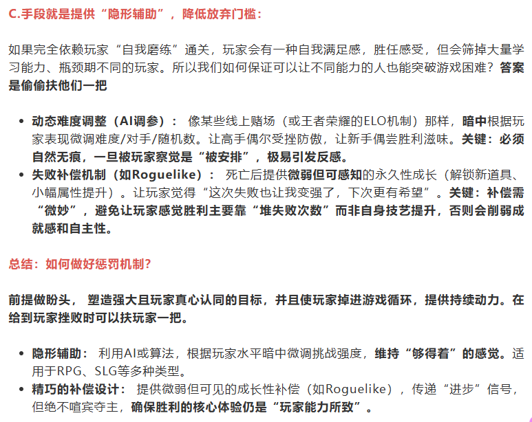

# 游戏情感与心理学

> 来源：飞书文档《游戏情感》。本文件由 Codex 按知识点整理，尽量保留原始表述。图片已下载到 `assets/feishu-game-emotion/`。

## 本篇知识点

- 游戏情感
- 游戏心理学
- 1、寂寞论
- 2、成瘾机制

## 正文

## 游戏情感

https://mp.weixin.qq.com/s/ofdJpKyjPUsMzy1hOcUKQA?scene=25#wechat_redirect

《Florence》游戏中，作者利用玩法让玩家对游戏内的情感流动产生共鸣

做到了情感具象化

主要是源于人脑的机制，会自动将类似的感受进行关联，从而带入

而行动后的感受，远远比想象中的感受来的更真实

## 游戏心理学

#### 1、寂寞论

人类需要维持大脑的持续活跃，不然会陷入脑死亡

因此人们需要一直有事情可做，所以需要在寂寞的时候寻找娱乐手段

学习和娱乐统称为广义上的娱乐

而纯娱乐（无法提高自己认知/技能）被称为狭义上的娱乐

寂寞论的公式：狭义娱乐的时间/广义娱乐的时间=（0,1）区间的数值决定了这个人的寂寞值

寂寞值越高的人越缺乏目标，越低的人越充实和有规划

我的看法：对于狭义娱乐和广义娱乐的定义会随着娱乐产业的发展而变得越发模糊，因为越来越多的狭义娱乐开始拥有了提高自己认知/寻找生命意义的可能。某种程度上可以治愈生活带来的创伤/赋予生命更高的意义，因此，艺术性越高的作品越能让人们在狭义娱乐的同时体会到广义娱乐的利好。而对于寂寞值趋近于0的充实群体来说，此类作品并不单纯的为杀时间，而是像羽毛球一样能够锻炼肌肉，我称此类肌肉为情绪肌肉，通过经历故事和磨难来锻炼自己的情绪肌肉，从而在现实世界能够更有勇气的面对困难。

#### 2、成瘾机制

*图01：原飞书图片，位置：2、成瘾机制。*

*图02：原飞书图片，位置：2、成瘾机制。*

*图03：原飞书图片，位置：2、成瘾机制。*

*图04：原飞书图片，位置：2、成瘾机制。*
