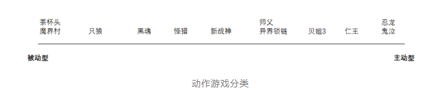
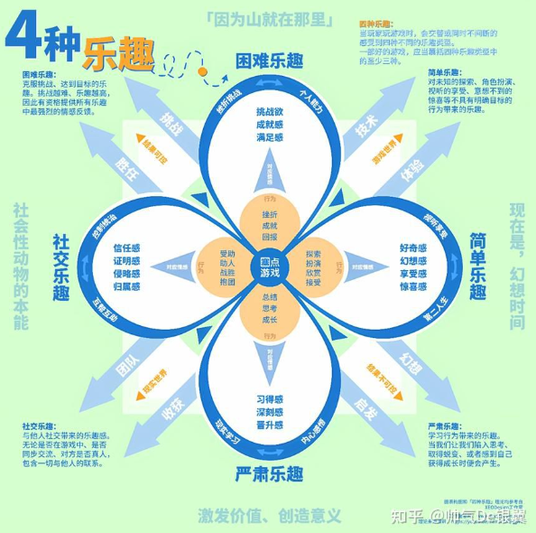
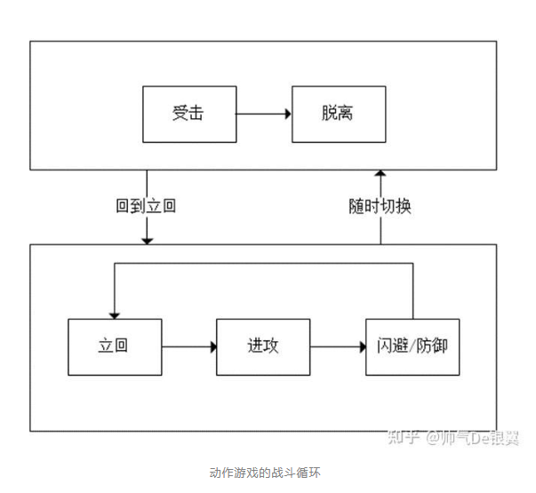

# 战斗系统与核心循环

> 来源：飞书文档《游戏情感》。本文件由 Codex 按知识点整理，尽量保留原始表述。图片已下载到 `assets/feishu-game-emotion/`。

## 本篇知识点

- 战斗系统
- 游戏的4种乐趣
- 游戏内的核心战斗循环
- 动作游戏考验：
- 给予玩家奖励的方式：
- 创造新的挑战的方式：
- 战斗内资源，分为三种——一次性资源，奖励型资源，循环型资源

## 正文

## 战斗系统

> 飞书表格块待导出：X4NcspOh8hd5jttaUo1cPWbTnsd_ofY47E

从被动型到主动型之间有很多个不同系数比例的游戏，如下：

*图05：原飞书图片，位置：战斗系统。*

#### 游戏的4种乐趣

*图06：原飞书图片，位置：游戏的4种乐趣。*

有趣内容时长：可能只有大约30s的有趣的内容一遍一遍的出现，因此，如果你能获得30s的有趣体验，你就可以将它延伸成一款完整的游戏。{有点像对一首经典的歌曲的不同风格的演绎}

#### 游戏内的核心战斗循环

*图07：原飞书图片，位置：游戏内的核心战斗循环。*

立回：通过改变自己的位置和其他的行动使自己在对战中处于有利的位置

进攻行为——简单的乐趣

提升进攻行为乐趣的方式：

1、增加招式

2、转换攻守切换频率

3、引入额外挑战

第二点，关于攻防转化频率

攻防频率转换越高的游戏越刺激，并且对抗的强度越高，代表有的茶杯头攻守同时

攻防转换频率不能是纯随机，玩家一定要能对敌人的行为进行学习

#### 动作游戏考验：

> 飞书表格块待导出：X4NcspOh8hd5jttaUo1cPWbTnsd_y9KF1v

#### 给予玩家奖励的方式：

> 飞书表格块待导出：X4NcspOh8hd5jttaUo1cPWbTnsd_Bey7HJ

#### 创造新的挑战的方式：

> 飞书表格块待导出：X4NcspOh8hd5jttaUo1cPWbTnsd_t01Rp3

单个行为而言，产生的反馈越多，影响越多，其乐趣也就越多

#### 战斗内资源，分为三种——一次性资源，奖励型资源，循环型资源

一次性资源——设计师不想让玩家一直使用的——如回血药

玩家【无限】复读（局部）最优解时，才会感到无聊

对于玩家有价值的东西，其状态的改变能带来体验

M->D->A    游戏机制->玩家行为->玩家体验

奖励型资源——玩家连续进攻积攒资源，然后消耗资源释放强力技能

【压力的积攒和释放】和【释放时的视听触表现】

循环型资源——影响玩家战斗循环，能完全（深度）参与进战斗循环中的资源

体力，精力等

对行为起限制作用，提供资源的分配，资源轮转的玩法，通过资源来控制玩家行为，让玩家重复执行最有趣的行为。

决策的乐趣在于【战胜挑战，找出当前的最优解】
