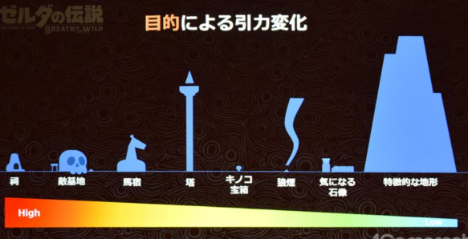
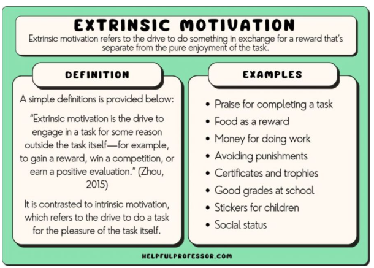
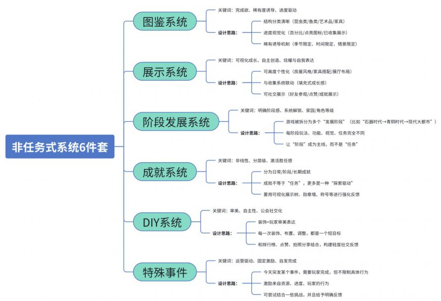
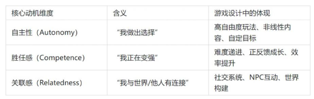

# 任务系统与目标驱动

> 来源：飞书文档《游戏情感》。本文件由 Codex 按知识点整理，尽量保留原始表述。图片已下载到 `assets/feishu-game-emotion/`。

## 本篇知识点

- 任务系统
- 主线任务
- 替代任务系统的方式—多元目标驱动系统
- 为什么要替代任务系统？——显性动机的弊端
- 具体解法
- 论据支撑
- 游戏类型分类（需补充）
- 概念

## 正文

## 任务系统

任务系统在游戏内的主要功能：【引导】【奖励】【目标设定】

### 主线任务

大部分游戏使用主线任务进行流程引导

但主线任务不应过度限制玩家自由，仅作为引导，目标是过河，而如何过河由玩家自己探索发现

更不应该出现【压制】【指挥】等限制性体验

> 飞书表格块待导出：X4NcspOh8hd5jttaUo1cPWbTnsd_7zYAec

> 飞书表格块待导出：X4NcspOh8hd5jttaUo1cPWbTnsd_vRdKYx

塞尔达中的引导示例

*图08：原飞书图片，位置：主线任务。*

### 替代任务系统的方式—多元目标驱动系统

#### 为什么要替代任务系统？——显性动机的弊端

游戏需要的不是任务而是目标

比较优雅的方式是实用非显性动机去引领玩家进行游戏

显性动机（即强引导任务）玩起来的感受与上班获得工资的心路历程相同，因此会让人产生“上班感受”

如果玩家过度依赖任务系统，一但系统消失玩家则会产生失焦状态，无法继续游玩

*图09：原飞书图片，位置：为什么要替代任务系统？——显性动机的弊端。*

#### 具体解法

以下系统可以组合替代任务系统

*图10：原飞书图片，位置：具体解法。*

#### 论据支撑

注明的心理学理论——自我决定理论

*图11：原飞书图片，位置：论据支撑。*

1、给玩家自主选择的权利——激活决定感

2、给玩家成长路径上的反馈——激活胜任感

3、给玩家完成目标后的联结——激活关联感

## 游戏类型分类（需补充）

> 飞书表格块待导出：X4NcspOh8hd5jttaUo1cPWbTnsd_gk0vsA

##### 概念

ROI 投资回报率 return in investment =（税前年利润/投资总额）*100%

LTV 生命周期总价值 life time value 公司从用户所有的互动中所得到的全部经济收益总和

ROI=LTV/成本

次留=第二天再次登录游戏的玩家/前一天登录过该游戏的玩家

7留=7日后还能登陆游戏的玩家/7日前登录过该游戏的玩家

初期玩家要对游戏产生初步印象，他们觉得自己有能力玩这个游戏，然后逐渐理解基本规则和操作，

之后，玩家通过对战斗的掌控来，来感受到挑战中的刺激

有效性=引导后的状态-初始状态

可以通过引导后的情景任务来评估玩家的状态，即有效性

最关键的品质是“上手门槛”，如果玩家在尝试游玩的时候感到不舒服不自在，很大几率会离开，

但是如果是强调沉浸感或者比较硬核的游戏，可以在UI上进行限制，增加上手门槛的，但是可以获得更好的新手体验。

BR游戏=大逃杀游戏
