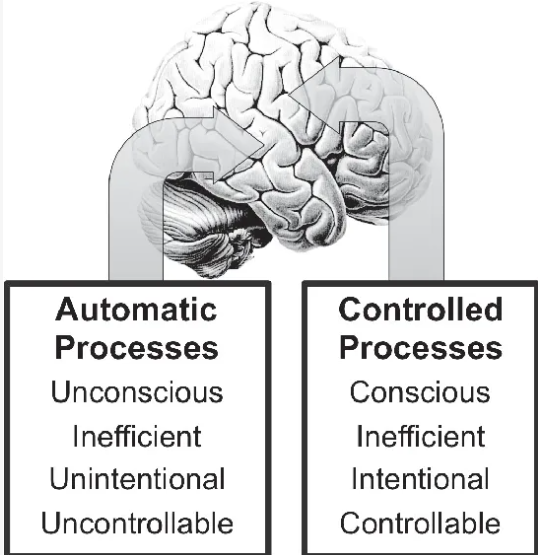

# 玩家行为观察与注意力

> 来源：飞书文档《游戏情感》。本文件由 Codex 按知识点整理，尽量保留原始表述。图片已下载到 `assets/feishu-game-emotion/`。

## 本篇知识点

- 玩家游戏行为观察理论

## 正文

## 玩家游戏行为观察理论

优势策略博弈——最优解

很多玩家都把玩游戏当成一个不断寻求最优解的过程

只要有一个优势策略存在，便足以磨灭游戏规划好的游戏性，并且有可能将其他策略都变为隐形策略，不再被使用

小丑牌的使用德州扑克的规则，大大降低了玩家的学习成本

喜欢=熟悉+意外

打牌是熟悉的，肉鸽是意外的

降低已有天花板游戏的上手难度和复杂度也是一种策略

另外可以根据最新大热玩法增加新的维度，但是要尽量在同个品类下，比如Build的经济系统

为自己建立一个系统，而不是定一个目标

系统是连续变化的东西，或者是一项技能，或者是一个关系，为了这个系统，你可以做各种项目，养成习惯，发展系统就是终极目的

注意理论：

随意注意

需要意志努力，主动做出关注行为

不随意注意

认知资源理论：认知资源是有限的，当刺激越复杂或加工任务越复杂时，占用的认知资源就越多

注意的双加工理论：

*图12：原飞书图片，位置：玩家游戏行为观察理论。*

游戏里的NPC独有的个性/会话，甚至能让玩家产生对系统功能的态度改变

恶人的恶，往往能够透露其背后悲惨的人物故事，并且让玩家理解他们的恶

古希腊悲剧式？的反派角色

通过保护和竞争营造NPC与玩家之间的关系

通过生物学，物理学，心理学三大角度可以建立可信的，优质的符合玩家期待的NPC角色
