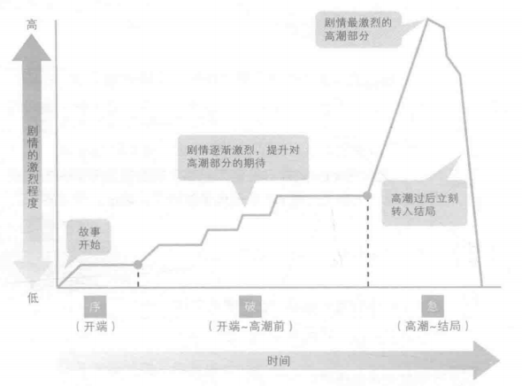
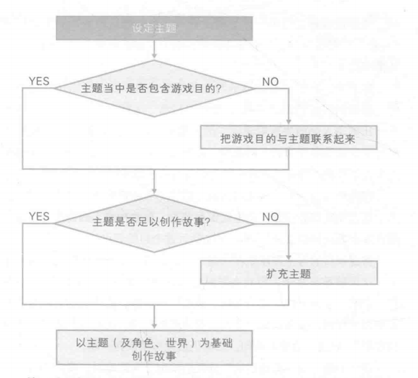
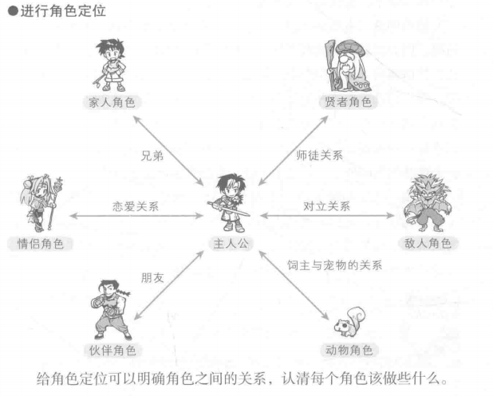
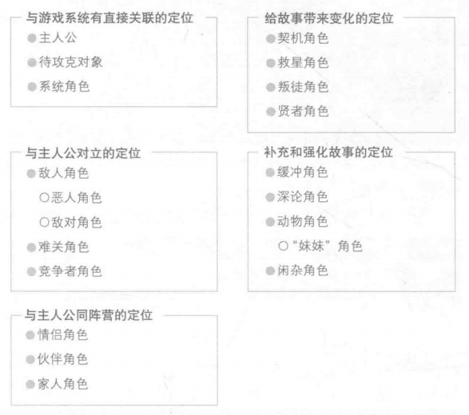
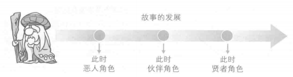
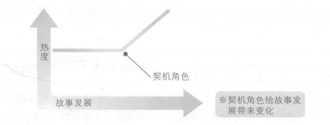
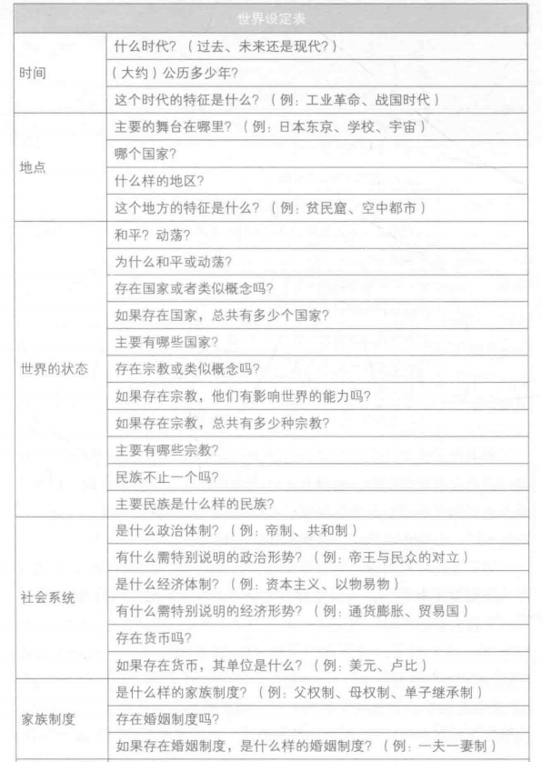
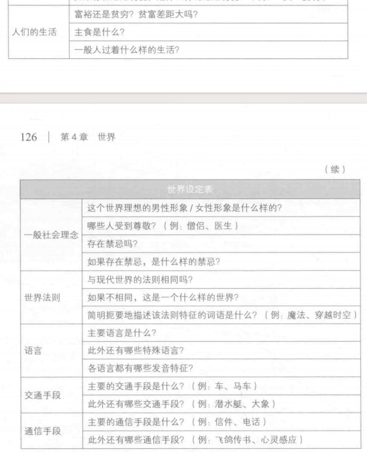
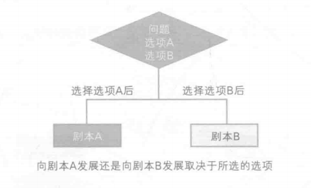
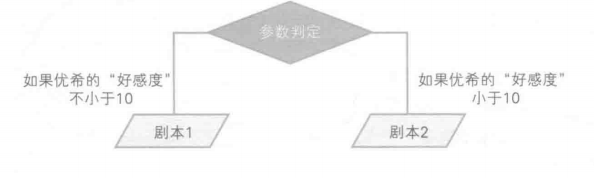

# 剧情写作：主题、角色、世界与结构

> 来源：飞书文档《游戏情感》。本文件由 Codex 按知识点整理，尽量保留原始表述。图片已下载到 `assets/feishu-game-emotion/`。

## 本篇知识点

- 游戏剧情写作要素
- 创作情节，结构及格式
- 主题与故事
- 主题
- 故事
- 灵感材料：
- 主题的表达：
- 角色
- 角色需要：
- 角色定位：
- 五种定位
- 主人公
- 系统角色
- 引导员
- 敌人角色
- 恶人角色
- ……共 43 个标题节点

## 正文

## 游戏剧情写作要素

#### 创作情节，结构及格式

1、将内容精简到3-5行，观察主旨兴趣，挑选有兴趣的，pass没兴趣的

2、根据策划书（紧贴游戏玩法创作故事）

3、充实情节——序破急(起承转合)

*图13：原飞书图片，位置：创作情节，结构及格式。*

4、剧本是写给开发人员看的，不要写成小说

例如：CG01“黑屏"

我做了一个梦

CG02“房间（夜晚）”

我抱臂坐在枕边

被窝里躺着一个女人

CG03“躺着的女人”

她平静地说。

### 主题与故事

##### 主题

1、一个词来表达的主题。例如“纯爱”

2、一个句子来表达的主题。例如“发生宇宙战争的话会怎么样”

故事是用来向玩家表达主题的内容

主题设定方法：

*图14：原飞书图片，位置：主题。*

##### 故事

游戏主题与游戏目的联系起来之后，故事会浮现出来

为了避免越追求主题，越偏离游戏目的，必须一开始就联系起来

扩充主题，添加设定可以帮助我们创作故事

##### 灵感材料：

> 飞书表格块待导出：X4NcspOh8hd5jttaUo1cPWbTnsd_5oQ7KN

##### 主题的表达：

主题不能写在剧本里！！

1、通过角色的选择与行为表现

2、通过故事的发展表现

### 角色

> 飞书表格块待导出：X4NcspOh8hd5jttaUo1cPWbTnsd_gdf6mj

##### 角色需要：

1、有魅力且有个性

2、避免角色定位重复

3、将角色的目的、意志、感情、行动与故事联系起来

##### 角色定位：

*图15：原飞书图片，位置：角色定位：。*

##### 五种定位

*图16：原飞书图片，位置：五种定位。*

一个角色可以同时拥有多个定位

甚至可以根据阶段转换身份

*图17：原飞书图片，位置：五种定位。*

##### 主人公

> 飞书表格块待导出：X4NcspOh8hd5jttaUo1cPWbTnsd_VDPkQi

##### 系统角色

游戏系统与玩家间的纽带，抱枕玩家顺畅的玩游戏（NPC）

##### 引导员

通过致电主人公的形式为玩家提供必要的知识

以上角色可能都会有出其不意的身份转变

##### 敌人角色

妨碍玩家达成游戏目的，从而使得故事变得有趣的角色

##### 恶人角色

绝对的恶，但纯的恶

##### 敌对角色

不是单纯的恶，但与主人公的行为敌对，像恶人的方式：恐怖的外表，做一些恶事（常理中）铺垫

##### 难关角色

妨碍故事顺利的走向，产生起伏

##### 竞争者角色

唤起玩家胜负欲，享受竞争带来的满足感

##### 情侣角色

基本都有一些内在设定，保守秘密或者背负使命之类的

##### 伙伴角色

帮助主人公达成目的的战友，拥有主人公不具备的能力或者特点，帮助主人公达到目的

倾听者 引出主人公情感，增加情感的振幅，加强玩家的理解

可以让伙伴角色最初以敌人的身份登场，展现其魅力，吊起玩家胃口

伙伴不能是好好先生，要有对立才能创作出有趣的插曲

不要让角色成为“死角色”，可以牺牲，可以变脸

也可以给敌人角色安排伙伴角色

##### 家人角色

社会基本观念——家人是好的

#### 让故事产生变化的角色

##### 契机角色

给主人公创造某种契机，使得情感，意志，行动会发生变化

*图18：原飞书图片，位置：契机角色。*

##### 救星角色

走投无路时，推动故事继续发展

##### 叛徒角色

可以创造一个比他更坏的人对他不好，从而渲染他不可能背叛的情景

##### 贤者角色

讲述传说/教诲，可以带领他们参与磨难，给予知识和道具，促进故事发展，形象普遍年纪比较大

#### 补充和强化故事的角色

让故事更有说服力

##### 缓冲角色

比如悲剧中的丑角

##### 深论角色

利用自身预言，理论，态度解释故事中难以理解的部分，追根究底的角色，让故事的细节展现，警察等

##### 动物角色

通过在“宠物”和“野兽”之间的变换来表明其他角色的好坏

妹妹角色也是动物角色之一，去除野生，只保留宠物

##### 闲杂角色

负责提供一些信息，与故事发展无关，摆在那里就有意义

### 世界

*图19：原飞书图片，位置：世界。*

*图20：原飞书图片，位置：世界。*

##### 制定世界的规则

规则要有真实感，要能被大众接受

世界存在于游戏系统之中

## 剧情结构

如何将故事写成剧本

结构——传递信息时，最容易给人留下印象的组合方式

### 开端

传达游戏目的——在这款游戏里应该做什么？

传达游戏的玩法——加入教程

传达这是一个什么样子的游戏——主角是谁，是什么世界

### 通往高潮的过程

游戏失败在故事中代表着什么

最长也是设计最难的部分

##### 通往高潮的章节分四类

> 飞书表格块待导出：X4NcspOh8hd5jttaUo1cPWbTnsd_9yVVQC

### 高潮

达成游戏目的的瞬间

前面整个过程的结算

### 结局

向玩家传达游戏目的达成后产生了什么结果的部分

如何联系写与游戏系统相关联的故事

给简单的游戏写故事——俄罗斯方块，黑白棋

#### 善于表达的方式

1、了解目的

2、感到疑问、产生兴趣

3、感情带入

4、意外、吃惊

5、期待、进一步带入感情

6、期待值达到最高峰、彻底带入感情、期待结论

7、对结论、高潮的回应

8、对结论的持续回应

#### 高表现力结构的要点

1、传达目的

2、促进感情的带入

3、挑起对高潮的期待

### 选项

玩家自主选择

*图21：原飞书图片，位置：选项。*

与参数相关的选择

*图22：原飞书图片，位置：选项。*

无意义的选项

选项设计铁则：没有破绽；不要让玩家感受到压力

如何满足以上两点，需要明确选择的基准；设计具有必然性的选择结果
