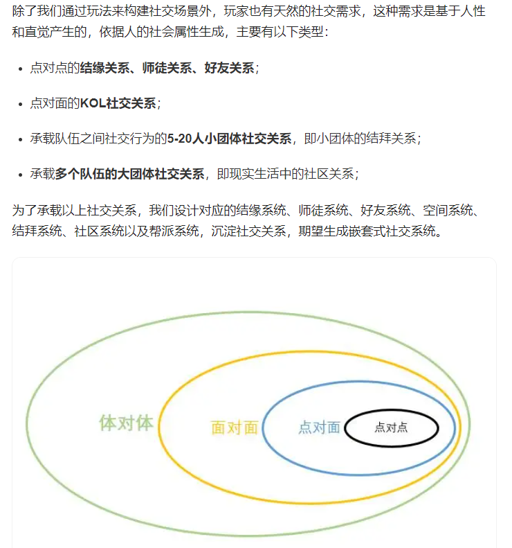
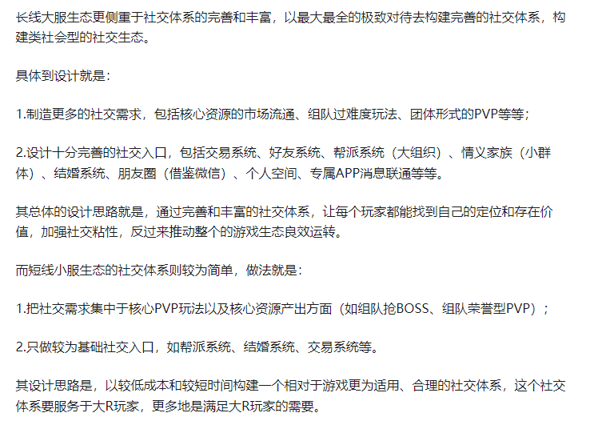
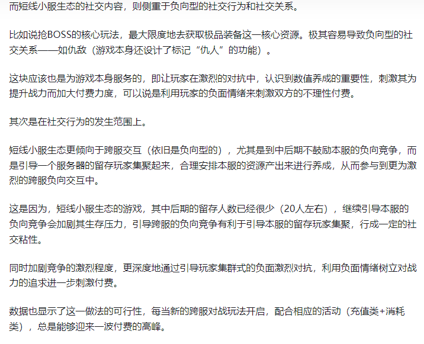
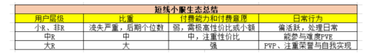
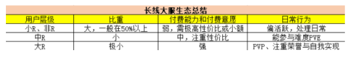
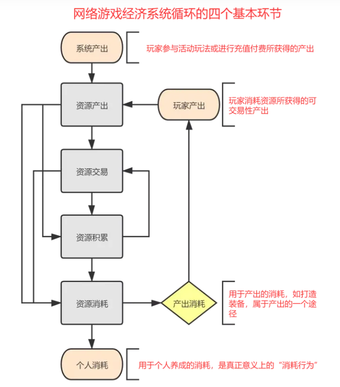
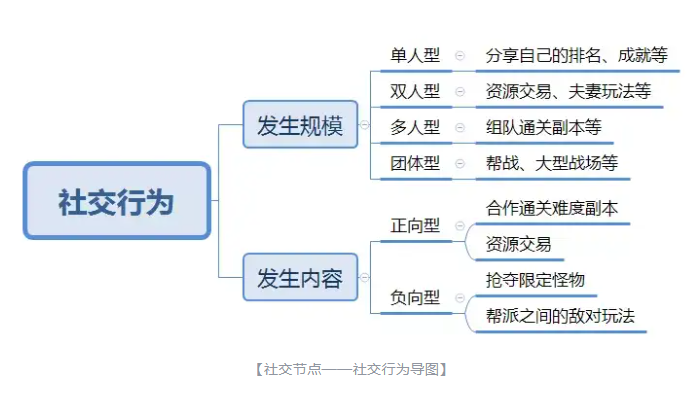
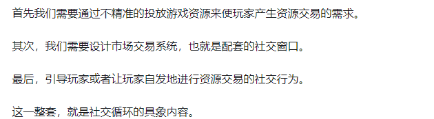
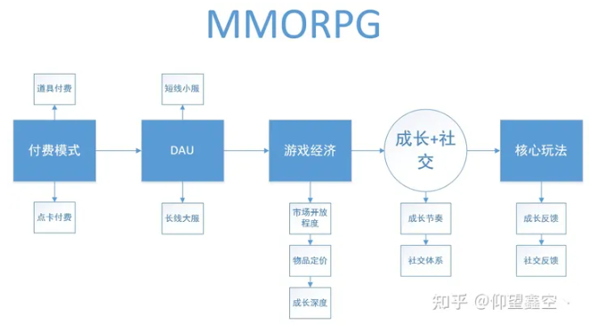

# 游戏社交框架

> 来源：飞书文档《游戏情感》。本文件由 Codex 按知识点整理，尽量保留原始表述。图片已下载到 `assets/feishu-game-emotion/`。

## 本篇知识点

- 游戏社交框架
- 一、产品社交目标和价值
- 1、内容价值
- 2、关系价值
- 3、回归价值
- 二、项目社交定位
- 1、核心玩法融入社交
- 2、核心体验融入社交
- 3、主要体验突出社交
- 4、非主要体验突出社交

## 正文

## 游戏社交框架

社交本质服务于体验

注意我们并不是一个纯社交游戏，纯社交游戏要么很简单，要么可以渗透到玩家的日常生活中

社交需要与系统深度融合

能够融合系统数值，满足项目社交目标，并且能够在项目本身的核心或者是主要体验中插入社交体验的结构即可

1、明确社交模块的定位，并围绕这个定位构建一套可以达成社交目标的行为玩法路径。

2、构建适合本项目的从游戏内容体验到玩家内容体验的社交体验流程。

前者应该普适于所有想要融入社交模块并期望社交带来一定价值的项目，而后者则更多的服务于拥有复杂社交场景的项目。

战斗 养成 社交

1、师徒系统

2、什么时间节点开始需要社交，首先利益驱动产生内容价值，之后转化为关系价值

### 一、产品社交目标和价值

设计目标需要与数据结合

社交价值

#### 1、内容价值

竞争中 公平的竞争更容易产生乐趣

合作能达成自身不可为的事物

特定话题引发乐趣传播

#### 2、关系价值

情感交流

“稳住，我还能打”

公平与不公平的竞争

挑战，陪伴与责任下的合作

通过圈层的形式，持续投入有递进式的目标

#### 3、回归价值

人，事，物的真实简直恢复展现，社交有能力将事物的真实价值展现出来

### 二、项目社交定位

#### 1、核心玩法融入社交

moba 吃鸡 QQ飞车

普遍上手容易精通困难，通过降低门槛来吸引大量用户，并构建自身生态

1. 熟人社交

1. 陌生玩家趣味玩法

核心玩法融入社交后，天然增加不确定性，导致前期玩法需要大量时间打磨

#### 2、核心体验融入社交

mmo slg

a.陌生玩家互动，提升留存

b.社交产生乐趣与情感内容，二创

海外尤其欧美，在社交上缺乏一些前期教育，因此用户量级会小

#### 3、主要体验突出社交

光遇， 一念逍遥

1. 社交带来内容，乐趣，情感价值

社交关系缺乏更多的场景强化，不会特别深入

单人拥有完整的核心体验线

#### 4、非主要体验突出社交

原神，星铁

游戏本身的内容非常突出，社交仅仅是已有关系的强化

*图23：原飞书图片，位置：4、非主要体验突出社交。*

https://www.bilibili.com/read/cv26104911/

两个关键点

社交——情感需求和奖励

需要有大量的功能去满足玩家的社交行为，与社交行为对应的社交手段是局内系统

根据初期玩家对好友的需求来判定，要不要将加好友作为任务的一部分

后续拓展——朋友圈

帮会并不是需要玩家强制加入，而梦幻西游中帮会属于强社交关系

情缘与结义

更深层次的亲密关系，是否限制性别，有特殊任务奖励

组队与团队

为了照顾社恐玩家和“独狼”玩家会匹配AI玩家帮助完成副本挑战

陌生人交互 互动玩法 交流 切磋

个体交流意味着差异化，只有双方有差异才能交流，并且要进行身份识别，将自身的信息传递拆出去让对方知道，才能形成社交，——个人信息展示，社交窗口渠道——聊天，场景，语音。

进行过社交行为之后产生的情感，将这种情感标签化便形成了社交关系，叫做社交沉淀

以下为社交沉淀的维度

1、社交类型——正向：合作，交流，创造，交易，负向——竞争，冲突

2、权限——独自空间，组织的管理权限等

3、窗口——文字表情包语音等

4、频次——提高社交频次

5、规模——社交规模越大，人数越多，则沉淀越浅，反之越深

建立社交关系可以满足短期的情绪释放，长期是情感需求的满足

马斯洛八阶需求模型中排名第三的：归属和爱的需要——一个人要求与其他人建立感情的联系或关系。例子：结交朋友，追求爱情。第一层为生存需求，第二层为安全需求。

第四层为尊重需求，需要玩家在社交的基础上建立练好的声望和地位，以此来建立认同感。

第五层是自我实现，玩家需要实现自己能力，表现为荣誉，虚荣心，顶端的人追求的目标

社交的最终目的，是完成自己的情感诉求

归属和爱的需求，社交关系需求的建立

1、个人信息展示

局内信息展示：名字、皮肤、个性化表情、动作

局外信息展示：段位、成就、精彩时刻、擅长英雄

游戏外：个人生活信息展示，心情，照片分享

2、社交窗口搭建

聊天：如个人好友、空间评论

分享：高光时刻、段位成就

合作：局内对战、局外任务

共享：如限时皮肤共享

创造：可以设置部分自定义内容，如自定义外观

组队：降低组队门槛

互动：搭建虚拟社交广场

3、社交关系和社交规模

情侣、师徒、挚友

战队、公会，

大R中R小R

小服生态：能更好的满足玩家在短线运营下的自我实现需求，并且以数值体验为主

长线生态注重社交体系的完善和丰富，以最大最全的极致对待去构建完善的体系

*图24：原飞书图片，位置：4、非主要体验突出社交。*

更多的满足大R玩家

*图25：原飞书图片，位置：4、非主要体验突出社交。*

侧重激化负向情绪，引发矛盾

中R 付费理智追求性价比 流畅的成长体验 尊重需求 容易因为时间被小R追上

短线小服会导致小R体验较差流失严重

*图26：原飞书图片，位置：4、非主要体验突出社交。*

*图27：原飞书图片，位置：4、非主要体验突出社交。*

短线——活跃类活动要适当的加入付费买活跃的设计

活动：固定框架 可以反复循环的使用，更替上线快

网游经济系统基本环节——产出，交易，积累，消耗

*图28：原飞书图片，位置：4、非主要体验突出社交。*

计划型经济系统 市场型经济系统

*图29：原飞书图片，位置：4、非主要体验突出社交。*

社交循环

*图30：原飞书图片，位置：4、非主要体验突出社交。*

*图31：原飞书图片，位置：4、非主要体验突出社交。*
