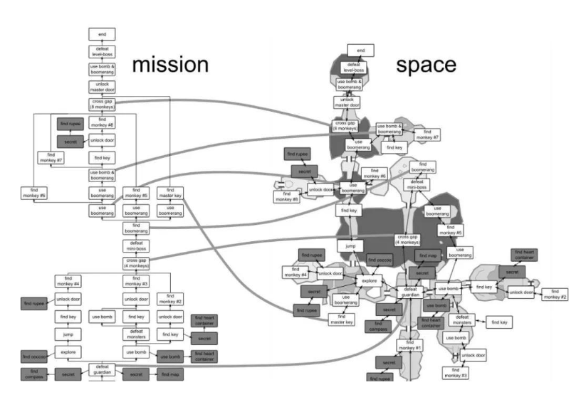

# 地图与空间设计

> 来源：飞书文档《游戏情感》。本文件由 Codex 按知识点整理，尽量保留原始表述。图片已下载到 `assets/feishu-game-emotion/`。

## 本篇知识点

- 地图设计

## 正文

## 地图设计

箱庭式关卡

*图32：原飞书图片，位置：地图设计。*

空间几何属性转化成任务逻辑属性

1、兴趣点 POI

2、开放区域

3、路径

4、存档点

5、初始点

6、BOSS点

7、全联通路径

A<-->B

8、单向路

A->B

例如悬崖，可跳跃平台，滑坡等

9、单向门

A->-B

10、机关门

A· ——>B

最小生成树

任何游戏都伴随着

风险与回报，因为只要是挑战就会蕴含着风险与回报

实现快节奏战斗的玩家移动动作机制

快节奏激烈战斗中消灭敌人

慢节奏一手一投足都攸关性命

镜头继承角色的移动方向，反映出玩家的真实意愿

地图设计结束
