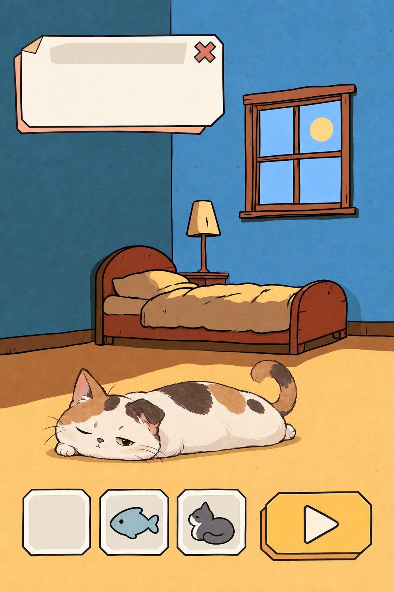

# 猫窝乱斗：美术方向与制作规范 V0.1

更新：2026-09-27。本文汇总当前已讨论的静态美术，作为后续制作与动效研究的入口。它是画风与提示词基线，不决定角色、用品、敌人的具体外观设计。具体画什么、长什么样、占几格与如何动，以当前策划文档为准；本文中的年糕猫、闹钟与整体合看图均是画风／提示词验证样稿，不能反向覆盖策划设定。

## 1. 当前结论与确认程度

| 项目 | 当前结论 | 确认程度 |
| --- | --- | --- |
| 整体观感 | 二维手绘，有设计感、轻微怪诞，猫要戳萌点，避免低幼感；优先明亮、易辨认的画面 | 用户明确表达的方向 |
| 生成工具 | 背景由 Midjourney 出图；猫、怪物、用品、图标与 UI 图像由 Codex 内置图像生成直出 | 用户明确确认 |
| 背景 | MJ 第二轮 3 号的夜晚卧室作为继续制作的视觉参考 | 用户反馈“感觉3号不错”；构图仍需适配游戏 |
| 猫 | 年糕猫用于验证软糯体态、松弛表情与不对称的画风表达 | 只作画风与提示词参考；正式猫的外观以策划文档为准 |
| UI | B 版纸片拼贴家族：切角、折角、错位纸层 | 用户明确纠正并选择 B |
| UI 细分 | B3 手裁纸片用于当前整体预览 | 用户认为 B1/B2/B3 差异不大，未单独明确选定 B3；不能写成排除 B1/B2 的最终选择 |
| 整体搭配 | 背景 3 号＋年糕猫＋B3 UI 的合看图 | 用户反馈“好像不错呢”，可作为当前搭配参考，非最终游戏布局审批 |
| 配色 | 画风提示词不包含固定颜色；具体资产可单独描述颜色 | 用户明确要求；现有蓝墙、暖地面、纸片色不是全项目强制色板 |

用户选择 UI 时，首轮图片实际显示顺序为 A、C、B，“第三版”指 B。此前 C2 是助手误解后生成的未采用探索稿；不得将 C/C2 当作已选 UI 基线。

## 2. 关键原图与来源

| 用途 | 视觉参考 | 提示词与来源 |
| --- | --- | --- |
| 背景 | [MJ 第二轮 3 号](背景探索/2026-09-27_Midjourney卧室/第二轮_03.jpeg) | [第二轮提示词](背景探索/2026-09-27_Midjourney卧室/02_第二轮提示词.md) · [运行记录](背景探索/2026-09-27_Midjourney卧室/运行记录.md) |
| 猫 | [无配色画风年糕猫](风格验证/2026-09-27_无配色画风/A_年糕猫.png) | [实际提示词](风格验证/2026-09-27_无配色画风/A_年糕猫_提示词.md) |
| 怪物 | [闹钟怪物样稿](风格验证/2026-09-27_无配色画风/B_闹钟怪物.png) | [实际提示词](风格验证/2026-09-27_无配色画风/B_闹钟怪物_提示词.md)；尚未加入当前整体预览 |
| 已选 UI 家族 | [B 版纸片拼贴](UI探索/2026-09-27_三版/B_纸片拼贴.png) | [实际提示词](UI探索/2026-09-27_三版/B_纸片拼贴_提示词.md) |
| 合看所用 UI | [B3 手裁纸片](UI探索/2026-09-27_B版深化/B3_手裁纸片.png) | [实际提示词](UI探索/2026-09-27_B版深化/B3_手裁纸片_提示词.md) · [三变体](UI探索/2026-09-27_B版深化/README.md) |
| 整体搭配 | [背景＋年糕猫＋B3 UI](整体预览/2026-09-27_背景猫UI/01_背景年糕猫B3UI.png) | [合成提示词](整体预览/2026-09-27_背景猫UI/01_合看_提示词.md) |



整体预览是 Codex 依据三张原图生成的合成示意，可能改变比例、细节与笔触；不是原像素精确叠放，也不是 Unity 截图。背景原始生产路线仍为 Midjourney。顶部面板位置、猫大小及底部物品栏排布均不代表正式玩法界面。

## 3. 各类画面如何配合

### 猫与怪物

样稿验证了柔软体态、松弛姿态、简练表情和小幅不对称可以表达猫的萌点，不需要统一使用大眼、腮红和幼儿化表情。这些是可写入正式资产提示词的表现方法，不是对正式猫体型、耳朵、眼睛或尾巴的设定。

怪物可以更可怕：通过错误比例、不协调五官、细长肢体和威胁姿态体现怪诞，不依赖全画面压暗。可爱、恐怖属于具体角色设计，不应把“所有主体都可爱”写入通用画风。

### 背景

沿用 3 号的简练墨线、大块墙面与地面、少量家具、夜晚但可看清的空间。用户认为此前背景 AI 感过重，后续避免细碎木纹、满屏装饰与复杂材质堆砌。当前样稿仍有可见纸纹，可作为参考，不把“完全无纹理”追加为用户要求。

提示词曾要求家具集中在上三分之一、下方留足游戏区，但实际 3 号没有完全满足，床的位置仍偏低。正式背景需要结合实际玩法区域另行调整，不能因方向获认可而跳过构图适配。当前试稿 2:3 不是最终设备适配规范。

### UI

B 家族的识别特征是切角、局部折角、错位的两层纸片，以及简练墨线。B3 在此基础上略增不对称切角和手裁边缘；内容区域仍需平整、端正，不因手作感牺牲阅读。

按钮、面板、物品格用相同的边角语言。普通、按下、不可用、选中状态不能只靠换色，需结合纸层错位、边框或内容对比度区分。当前生成图的按下状态与尺寸一致性尚不够准确，属于待制作问题。

UI 文字与数字由 Unity 排版，背景组件与图标单独制作。样板中的播放三角、鱼与猫图标只是视觉示例，不自动定义正式功能或用品清单。整张 UI 样板不能直接当作交互界面或生产图集。

### 整体搭配的判断

当前合看图中暖色猫与纸片 UI 能从背景中分离，视觉上未出现明显割裂。猫的干笔线更柔软细碎，背景与 UI 更硬朗；这是助手观察。保留这种适度差异是当前建议，不需要为了完全相同而重画全部素材。正式画面仍应在实际显示尺寸下检查层级与辨识度，当前没有完成该项游戏验证。

## 4. 提示词组织方式

沿用已讨论的 NDC 格式：**中文写具体设计，独立英文段写画风**。仅借用组织方式，不继承 NDC 的题材、黑色电影风格或固定配色。

```text
生成一张【用途】。
具体设计：【主体或组件、造型特征、姿态/状态、需要保留的识别点】
构图与背景：【数量、视角、画幅、占比、留白、背景形式】
配色要求：【仅本张确有要求时填写，否则删除】
参考图职责：【说明每张控制什么；是否继承颜色】
其他约束：【必须有/不得有的内容】

美术风格提示词：
【对应类别的英文画风段】
```

#### 角色画风基线

可复用全文与中文解释见 [通用画风母提示词](提示词/00_通用画风_不限定颜色_V0.1.md)。各批实际出图可能使用中文等价表述，以各自“实际提示词”文件为准，不把新模板倒写成历史输入。

```text
stylized 2D hand-drawn game illustration, expressive economical inkwork, naturally irregular contours, controlled line weight variation, decisive tapered strokes, bold simplified shapes, distinctive readable silhouettes, exaggerated proportions, selective asymmetry, simplified expressive features, clean flat fills, large coherent graphic masses, restrained planar shading, minimal surface rendering, sparse localized paper texture, selective detail density, clear visual hierarchy, strong shape readability at small scale, no preschool picture-book aesthetic, no decorative clutter, no all-over grain, no soft-focus glow, no smooth airbrushed gradients, no plastic gloss, no photorealistic materials, no 3D rendering
```

#### 纸片 UI 画风段（B3）

```text
stylized 2D hand-drawn paper-cut game UI, confident economical inkwork, clipped corners, selective folded corner, offset flat paper layers, subtle handmade contour variation, clean flat graphic masses, restrained hard-edged shading, spacious quiet interiors, clear readable silhouettes, consistent component family, no plastic gloss, no airbrushed gradients, no all-over grain, no photorealism, no 3D rendering, no preschool aesthetic
```

中文含义：二维手绘纸片 UI，简练墨线、切角、局部折角、错位纸层与细微手工轮廓，干净平涂块面、克制硬边阴影、充足内容留白、清楚剪影、统一组件家族。避免塑料光泽、喷枪渐变、满屏颗粒、写实或三维材质及低幼感。

#### 背景实际提交词

```text
Hand-drawn 2D indie game bedroom background, portrait composition. Small rounded wooden bed with a plump uneven quilt, simple bedside lamp and window grouped in the upper third. A little moon outside suggests nighttime, while the room stays bright and welcoming. Lower two thirds are open quiet floor for gameplay. Playful asymmetric furniture, confident variable ink contours, broad flat colored shapes, restrained matte shading, sparse local paper texture. Charming offbeat illustration, economical marks, warm lived-in personality, gentle elevated view, clear spacious composition. --ar 2:3 --no people, cats, monsters, text, UI, clutter, photorealism, 3D, monochrome, hatching
```

这是获得当前背景方向的完整场景词，不是仅画风词。包含布局目标，但成图没有完全遵守。MJ 长提示词在首轮出现自动压缩，后续保存实际提交内容与结果参数，不能假定逐字保留。

## 5. 资产保存与交付边界

- 每批生成前保留需求；生成后保存原图、实际提示词、参考图职责、工具及用户反馈。修订另存，不覆盖源图。
- 生成工具按已确认分工执行；整体合成预览可用 Codex，但不改变背景生产归属。
- 不把提示词中的“无渐变”视为成图已无渐变。当前 UI 仍有轻微渐变，猫和怪物也有额外纹理；以原图观察和实际用途判断。
- 暂不继续抠图；此前 macOS 抠图结果只留作探索记录。正式透明资产、边缘处理、切图、锚点、九宫格拉伸和分辨率尚待生产环节确定。
- 统一色板、量产资产名单、用品样稿及怪物加入战斗场景的合看仍未完成。文档记录当前阶段，不据此宣称全套美术完成。

## 6. 动效研究（已开始最小试验）

2026-09-28 用户明确希望采用逐帧动画，已授权用动作设计 skill 尝试 Codex 直接出帧。首个 [年糕猫六帧呼吸试验](动效探索/2026-09-28_年糕猫呼吸/README.md) 已生成图集并组装 GIF；采用白底样稿，不经过视频生成。当前仍在验证路线，未认定量产可行。优先使用已认可素材做小样，再决定资产是否需要拆层和补姿态。

建议首批研究对象：年糕猫的呼吸与耳尾微动、B 家族按钮按下时的纸层收拢，以及一种清楚的受击/攻击反馈。以上是讨论起点，尚未被用户确认为最终动作清单、时长或技术方案。

评价重点：动作是否保留猫的柔软感，是否破坏原画轮廓，UI 响应是否清楚，战斗反馈是否抢占阅读，以及制作成本是否适合后续批量扩展。待动效讨论后另建规范，不把未验证时长、拆分方式或性能结论写入静态画风基线。


## 7. 已确认的帧动画制作方式（2026-09-28）

用户看过年糕猫呼吸 GIF 后反馈“好可爱 没啥问题诶”，并要求后续沿用此方式。**Codex 直接生成分帧图，再切帧、对齐、组装播放，作为本项目后续角色帧动画的默认制作路线。** 本次呼吸效果已获用户认可，不再因先前记录的小幅绘制差异自动判为需要返工。

制作流程：

1. 使用 `video-motion-design-enhancer` 辅助设计准备、主动作、跟随、收势及循环衔接，转写为逐帧姿势与保持项；该 skill 不负责直接输出动画。
2. 以已认可的角色原图为参考，用 Codex 内置图像生成直接制作分帧图或图集，不先生成视频再抽帧。
3. 保存原始图集与实际提示词，切出单帧；必要时做位置对齐及统一画布留白，保留处理记录。不把对齐处理冒称完全未经处理的直出结果。
4. 设置逐帧停留时间，组装 GIF 供用户看实际动作，再按游戏所需规格导出。帧数、时长与循环方式随动作安排；6 帧、2 秒仅为本次呼吸样例，不是所有动作的硬标准。
5. 以实际播放的可爱感、动作可读性和可接受的一致性判断效果，不追求每帧像素完全相同。明显跳位、身份变化、肢体错误或影响使用的裁切仍需针对修正。

适用边界：用户已认可本次动作观感与后续制作路线；白底预览的认可不等于已确认透明处理、Unity 导入、攻击命中节拍或所有复杂动作的稳定性。后续分别处理这些生产需求，无须重问是否采用直接出帧路线。

参考样例：[年糕猫呼吸 GIF](动效探索/2026-09-28_年糕猫呼吸/04_头部对齐_呼吸预览.gif) · [原图、分帧与制作记录](动效探索/2026-09-28_年糕猫呼吸/README.md)。


## 8. 已确认的特效制作方案（2026-09-28）

用户看过猫爪命中预览后反馈“好可爱！就用这个方案”，认可本次效果与制作路线。

**有明确造型和阶段变化的特效，默认由 Codex 内置图像生成直接制作序列帧图集，再切出单帧、设置时序并组装预览，随后按需导入 Unity 播放。** 不经过视频生成或抽帧。动作设计可借用项目动作设计 skill，将准备、峰值、碎片跟随和消散写清楚。

已认可样例：[猫爪命中特效](特效探索/2026-09-28_猫爪命中/02_正常速度.gif) · [原图、透明单帧、提示词与时序](特效探索/2026-09-28_猫爪命中/README.md)。六帧动作共 380ms；循环预览的 800ms 空白只是演示间隔，不是游戏攻击间隔。帧数和时长随具体特效确定，不要求所有特效照搬六帧。

视觉参考为短促手绘爪痕、清楚的大块面爆点及少量碎片消散。本稿虽有超出提示词预期的半透明柔光，但用户已认可实际观感；不因“无柔光”的早期提示词自动否定或重做成图，也不把柔光推广为所有特效必须有的元素。

单帧保留原始透明通道，GIF 展示底不属于特效。游戏内轨迹、朝向、大小、播放时机和命中同步由 Unity 控制；这是接入职责，不表示本稿已完成游戏集成。正式场景中的叠加效果仍需在接入时查看。

飞行碎片使用单张图配合程序运动、按钮等简单反馈由程序控制，仍是可按需采用的实现建议；本次明确认可的是已展示的序列帧命中特效，不等于已验证所有特效类型。
