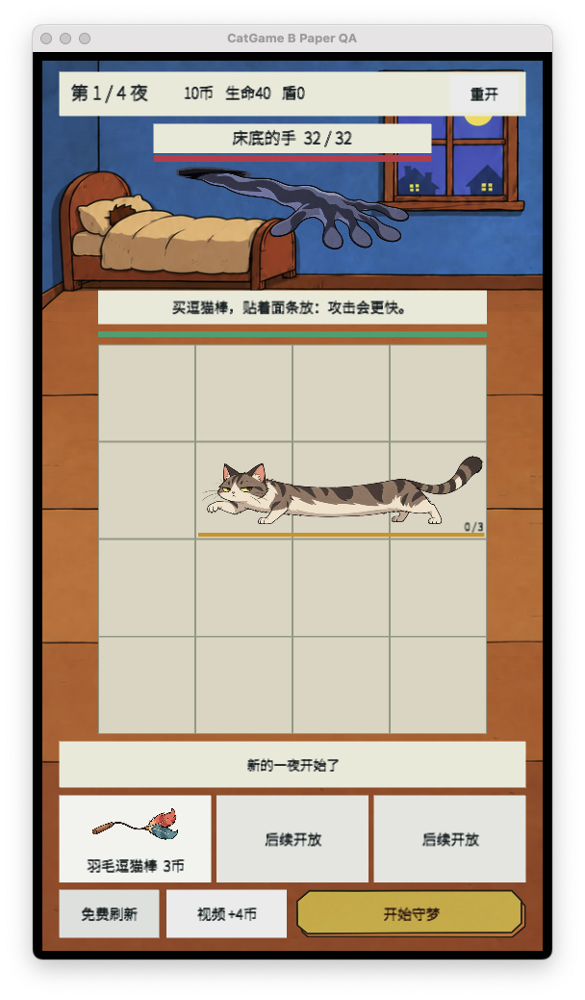

# B 纸片按钮正式工程试接报告

**结论：** 当前 `StartBattle` 试接可通过 Unity 编译与 macOS Player 构建，并在第 1 夜准备态实际显示 B 纸片按钮。截图中“开始守梦”四字完整、深棕文字未溢出；金色纸片填充与四角描边完整，底栏右侧按钮与相邻奖励按钮之间留有间距，没有遮挡。

## 验证范围与方法

Unity CLI 对正式工程执行一次连接检查，结果为无可连接的 Editor 实例（`STATUS_NO_INSTANCES`），因此没有在打开的正式工程编辑器内操作。随后将正式工程当时的以下三个文件逐字节同步到 `/tmp/catgame-b-paper-trial` 隔离工程并据此构建：

- `Assets/CatGame/Presentation/UiFactory.cs`
- `Assets/CatGame/Editor/PaperTrialImport.cs`
- `Assets/CatGame/Resources/UiTrial/b_paper_primary.png`

隔离构建另将场景 `UseSave` 设为 `false`，并使用临时 QA 公司名和产品名，避免读取或写入现有游戏存档，以及避免连接到已经运行的正式游戏进程。这两项只存在于 `/tmp` 隔离副本，不是正式工程改动。

- Unity `6000.4.0f1`，目标 `StandaloneOSX`；最终构建退出码 `0`，没有 C# 编译错误。
- Player 实际进入第 1/4 夜准备态；截图尺寸 `608×1038`。没有点击游戏控件。
- PNG 尺寸 `496×104`；资源导入为单张 Sprite，PPU `200`，四边切片 `36×16`，关闭 mipmap。`Resources.Load<Sprite>("UiTrial/b_paper_primary")` 在运行画面中成功呈现。
- 构建日志有 `GameRoot.cs` 的弃用 API 警告，以及 CLI license handshake / Pipeline 端口提示；Unity CLI 仍报告构建成功。

## 结论边界

代码为 `StartBattle` 和 `Next` 配置了同一资源加载路径，但本次可见画面只验证了准备态的 `StartBattle`。`Next` 运行态、鼠标/触摸事件命中和临时按下变色均未验证；本报告不将编译或截图描述为这些交互已经通过。
